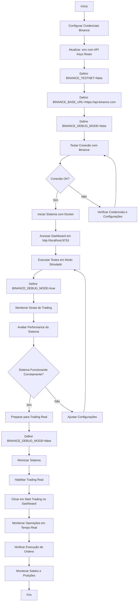

# Fluxo de Operação na Conta Real da Binance Spot

Este documento apresenta um diagrama Mermaid que ilustra o fluxo de operação do sistema TraderMagic na conta real da Binance Spot.

## Diagrama de Fluxo

## Descrição dos Passos

1. **Configurar Credenciais Binance**: Obter API Key e Secret Key da conta real da Binance
2. **Atualizar .env**: Substituir as credenciais da testnet pelas credenciais reais
3. **Definir BINANCE_TESTNET=false**: Configurar o sistema para usar a conta real
4. **Definir BINANCE_BASE_URL**: Apontar para a URL da API da conta real
5. **Definir BINANCE_DEBUG_MODE=false**: Desabilitar o modo de simulação
6. **Testar Conexão**: Verificar se o sistema consegue se conectar à API da Binance
7. **Iniciar Sistema**: Executar o sistema usando Docker
8. **Acessar Dashboard**: Abrir o painel de controle no navegador
9. **Executar Testes em Modo Simulado**: Testar o sistema em modo simulado antes de operar com dinheiro real
10. **Monitorar Sinais**: Verificar se os sinais de trading estão sendo gerados corretamente
11. **Avaliar Performance**: Analisar a qualidade dos sinais e decisões do sistema
12. **Preparar para Trading Real**: Configurar o sistema para operar com dinheiro real
13. **Habilitar Trading Real**: Ativar a execução de trades reais
14. **Monitorar Operações**: Acompanhar as operações em tempo real
15. **Verificar Execução**: Confirmar que as ordens estão sendo executadas corretamente
16. **Monitorar Saldos**: Acompanhar os saldos e posições da conta

## Considerações de Segurança

- Sempre teste o sistema em modo simulado antes de habilitar o trading real
- Monitore constantemente as primeiras operações reais
- Mantenha as credenciais da API em local seguro
- Não compartilhe suas credenciais com ninguém